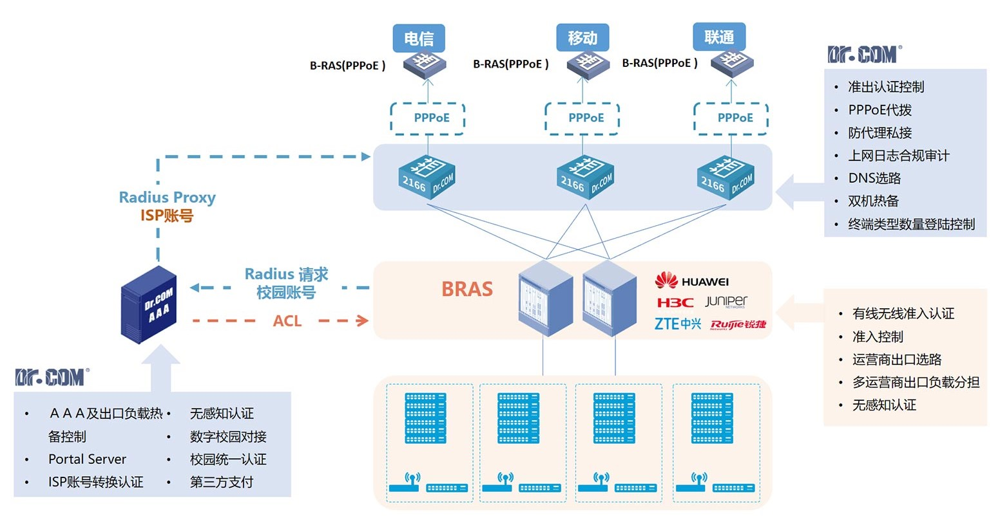

# 广医无限校园网（Unlimited Campus Net in GMU）

## 1. 梗概

本项目主要介绍了可以实现无限使用广医校园网流量的3个思路，分别是MAC地址伪造、局域网代理和WiFi钓鱼，这些方法实测可行，下文将详细讲述。

## 2. 校园网概况

在广医，连接无线网络后需要通过门户网站的认证才能访问互联网，而认证方式主要有账号密码登录认证和无感登录认证。使用图书馆等区域的校园网访问互联网的流量是不计入每月的流量使用的，而使用宿舍区的校园网访问互联网的流量则是计入每月的流量使用的，每月流量用完后无法连接互联网。

## 3. MAC地址伪造

### 3.1. 概述

这个方法主要利用了校园网API存在的水平越权漏洞以及校园网的无感登录功能，首先通过API漏洞获取到其他用户已登录设备的MAC地址，再通过另一API判断该MAC地址是否已绑定账号，若是，则说明该MAC地址支持无感登录，等到该设备离线后，将本机的MAC地址修改为此绑定账号的MAC地址，从而将本机伪造为已绑定设备，此时本机将通过无感登录功能自动登录校园网，并以其他用户的身份联网，所有访问互联网的流量都只会计入被伪造MAC所绑定的用户，从而实现免费上网。

**注意**：此处所用到API及使用示例均能在[GZHMU/gzhmu-api](https://github.com/GZHMU/gzhmu-api)的gmuapi模块找到。

### 3.2. 实现原理

广医校园网认证方式主要有两种，即账号密码登录认证和无感登录认证，前者即是通过在门户网站登录页面输入账号密码进行手动登录，而无感登录是校园网通过识别设备的MAC地址自动进行登录。

无感登录原理。在默认的情况下，用户校园网账号的无感登录功能是开启的，在无感登录功能开启的情况下，用户使用账号密码手动登录认证成功后，校园网会记录登录设备的MAC地址，并将该MAC地址与用户账号进行绑定，此后当相同MAC地址的设备连接校园网时，校园网能够识别已绑定的MAC地址自动进行登录，而无需再次输入账号密码手动登录，这就是无感登录。当手动将MAC地址解绑后，则无法进行无感登录，除非再次在相同设备上用账号密码登录重新绑定。当然，如果账号关闭了无感登录功能，用此账号登录的设备就都不会被绑定，也就无法实现无感登录。

校园网认证上网原理。当使用联网设备连接校园网并成功认证登录后，校园网会记录该登录设备的IP地址、登录时间和MAC地址，并将这条记录保存到数据库中。当一个设备连接校园网后，校园网会比对数据库中是否存在该设备的MAC地址，从而判断设备是否已登录，若已登录，则网关允许此设备联网，此时该设备就能上网了；若未登录，则会让设备的浏览器跳转到登录认证页面。若在校园网手动将设备登出时，该设备的认证记录会从数据库中删除，设备就无法联网。若设备断开校园网，但没有手动登出时，数据库中的认证记录不会被马上删除，而是会保留一段时间（约为25分钟），当校园网发现一段时间里该设备没有联网活动，校园网才会认定该设备已经登出校园网，从而删除认证记录。

通过对登录校园网认证时产生的网络请求进行抓包以及对前端js代码进行分析，可以找到用于获取用户信息（学号、姓名、余额和流量使用情况）以及在线设备信息（IP、MAC地址、登录时间）的API，这些API使用学号作为查询参数，可以获取到该账号对应的信息。此外还有一个重要的API，能够查询指定的MAC地址是否已绑定到某个账号，用于无感登录。

一般基于安全性的考虑，安全性较高的网站应该对查询这些API的网络请求进行鉴权，只允许在登录认证成功后才能查询自己账号的信息，而禁止未登录的查询，以及禁止登录后查询除自己账号之外其他账号的信息。

然而校园网的门户网站存在一个水平越权漏洞，即门户网站并未对查询API的任何网络请求进行鉴权，从而导致任何人只须连接校园网，无须登录认证，通过使用学号作为查询参数，直接请求这些API就能轻松获取任意账号的信息。

这里主要利用的是获取在线设备信息的接口，通过该接口可以获取指定账号下的所有已登录设备的信息，包括设备的IP地址、登录时间以及MAC地址。获取到MAC地址后，再通过另一个接口查询该MAC是否绑定到某个账号，如果是，说明此MAC可用于无感登录，要将MAC地址与其对应的账号建立映射关系保存下来。

由于同一局域网下，每个设备只能拥有一个唯一的MAC地址，若存在两个相同MAC地址的设备时会导致这些设备无法联网。所以，获取到可用于无感登录的MAC地址及其对应的账号后，等待一段时间，通过接口查询该账号下的在线设备，判断此MAC地址的设备是否在线，当确定目标设备已离线时，可将自己设备的MAC地址伪造为该设备的MAC地址，此时自己的设备即可通过无感登录功能自动登录，实现免费上网。若此时目标设备再次连接校园网便会与伪造MAC的设备冲突，导致双方网络异常，为避免冲突，伪造设备必须及时切换为原来的或其他的MAC地址。

### 3.3. 具体方法

1\. 通过网络接口获取在线设备信息

利用接口的水平越权漏洞，使用暴力枚举的方式获取在线设备信息。

2\. 筛选目标设备

由于部分电脑设备的无线网卡在windows系统下对MAC地址的修改存在限制，为确保被伪造MAC地址可用性，需要先对MAC进行筛选，需要选择左起第2个十六进制位为2、6、A和E的MAC地址的设备作为目标设备（如：A2BCDEF123和A6BCDEF123，而A7BCDEF123则不行），否则将无法修改MAC地址进行伪造。参考：[在 Windows 下修改 MAC 地址时，为什么第 2 个十六进制字符只能是 2、6、A、E 之一？](https://www.zhihu.com/question/21805731/answer/19377093)

然后需要筛选已绑定账号的MAC地址，将已绑定账号的MAC地址与其对应的账号建立映射关系保存下来。

3\. 伪造目标设备

等待一段时间后，重新查询账号的在线设备列表，查看绑定账号的MAC地址设备是否在线，若离线，则可作为伪造的目标设备，将自己设备的MAC地址伪造为目标设备的MAC地址。

在windows下可以通过修改注册表来将自己设备的MAC地址修改为目标设备MAC地址，具体方法参考网络资源，修改后再重启网卡即可实现修改，重启网卡后需要重新连接校园网需要等待1-2分钟识别网络，成功识别网络后就能联网了。通过使用`ipconfig /release WLAN`命令手动释放IP地址，然后`netsh wlan disconnect`命令断开无线网路，再`netsh wlan connect name=GZHMU-Dorm`命令重连的方式，能加快网络识别的速度。

4\. 实时监控网络状态

伪造MAC地址期间必须运行有实时监控网络状态的程序，当检测到网络异常，可能是被伪造设备再次上线了，此时监控程序必须将设备修改为其他MAC地址避免冲突，以防扰乱其他用户的正常联网。

### 3.4. 优缺点

1\. 优点

- 可以实现几乎无限流量的上网，适于下载大文件，若找到使用教师账号登录的设备可有几百GB甚至几TB的可用流量

2\. 缺点

- 用网体验不佳，白天不稳定，为避免MAC冲突可能需要经常修改MAC地址，晚上会比较稳定

- windows下每次修改新的MAC地址需要等待识别网络

- 对设备有要求，一般需要使用电脑，如果使用移动设备需要Root后才能修改MAC地址

## 4. 局域网代理

### 4.1. 概述

在教室或图书馆搭建一个代理服务器，让该服务器连接并登录校园网，在宿舍可以使用代理客户端连接该代理服务器实现免流量上网。

### 4.2. 实现原理

此方法基于3个前提条件：

1. 教室和图书馆联网不计流量

2. 连接校园网的各设备之间的数据传输不计流量

3. 校园网各设备的IPv4地址不被隔离，可以相互连通

在教室或图书馆搭建代理服务器，开启IPv4，让服务器登录校园网，配置好代理服务端并运行，开放代理的防火墙端口，此服务器就能联网了，同时能为其他具有IPv4地址的局域网设备代理网络请求。

客户端开启IPv4支持，连接校园网，无需认证登录，在客户端程序添加校园网中的代理服务器的IPv4地址和密码，开启全局代理，即可实现无限流量免费上网。

### 4.3. 具体方法

可以选用旧手机或软路由等设备作为代理服务端和客户端的硬件，软件可用开源的Project V的v2ray或者shadowsocks等等，详见官方文档。

以Clash为例，用一台旧手机作为代理服务端，连接教室或图书馆校园网并登录，记录IP地址，安装Clash，设置代理端口，并设代理模式为直连模式，启动代理。客户端在宿舍连上校园网后无需登录，只需在网络设置中手动设置代理，将代理的主机名设为服务端的IP地址，端口设为服务端的代理端口，如此便能实现无限流量上网。

### 4.4. 优缺点

1\. 优点：

- 连接稳定，不会影响其他用户正常联网

- 无限流量

2\. 缺点

- 需要额外成本购置支持IPv4的软路由或其他设备作为服务端

- 在教室或图书馆的如何维持服务端的持续电源供电是个问题

## 5. WiFi钓鱼

### 5.1. 概述

伪造钓鱼WiFi和校园网认证钓鱼页面，实施中间人攻击，获取账号密码。

### 5.2. 实现原理

首先确保电脑的无线网卡支持监听模式，或者使用支持监听模式的USB无线网卡，在linux下安装wifiphisher，将校园网登录页面下载下来，稍加修改伪造为钓鱼页面，配置好wifiphisher运行，当其他人连上钓鱼wifi时会跳转到制作好的钓鱼页面，只要用户在登录页面中输入账号密码并提交，wifiphisher就能获取到输入的账号密码。

### 5.3. 优缺点

1\. 优点

- 获取其他账号密码

- 真假难辨，成功率高

2\. 缺点

- 钓鱼范围小，不易有鱼咬钩

## 6. 免责声明

本项目仅供学习交流之用，请勿用于非法用途。由使用本项目导致的后果由使用者本人承担，与本项目无关。
